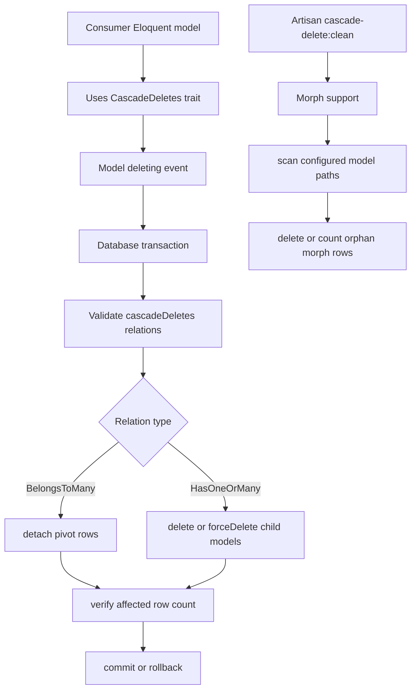

# Project Overview

`gigerit/laravel-cascade-delete` is a Laravel package that adds a
`CascadeDeletes` Eloquent trait for transactional cascading deletes across
standard, soft-delete, polymorphic, and many-to-many relations. It also ships an
Artisan cleanup command for orphaned polymorphic records left by bulk deletes.

## Repository Structure

- `.github/` contains CI, Dependabot, funding, and issue template configuration.
- `config/` contains the publishable `cascade-delete.php` package config.
- `src/` contains the package service provider, trait, command, support code,
  and package-specific exceptions.
- `src/Commands/` contains the `cascade-delete:clean` Artisan command.
- `src/Concerns/` contains the `CascadeDeletes` trait used by consumer models.
- `src/Exceptions/` contains package exceptions for invalid cascade definitions.
- `src/Support/` contains morph-relation orphan cleanup support.
- `tests/` contains Pest tests, Orchestra Testbench setup, and test models.
- `tests/Models/` contains in-memory Eloquent models used by the test suite.

## Build & Development Commands

Install this package in a Laravel app:

```bash
composer require gigerit/laravel-cascade-delete
```

Prepare Laravel package discovery after autoload updates:

```bash
composer run prepare
```

Run the Pest test suite:

```bash
composer test
```

Run tests with coverage:

```bash
composer test-coverage
```

Run PHPStan:

```bash
composer test:types
```

Format PHP with Pint:

```bash
composer format
```

Run the package cleanup command in a consuming Laravel app:

```bash
php artisan cascade-delete:clean
```

Preview cleanup without deleting rows:

```bash
php artisan cascade-delete:clean --dry-run
```

Publish package config in a consuming Laravel app:

```bash
php artisan vendor:publish --tag="cascade-delete-config"
```

CI mutates Laravel and Testbench constraints before Composer update; see
`.github/workflows/CI.yml` for the exact matrix install command.

CI runs tests with:

```bash
vendor/bin/pest --ci
```

CI runs PHPStan with:

```bash
./vendor/bin/phpstan --error-format=github
```

> TODO: No dedicated local run, debug, or deploy command is documented in the
> repository.

## Code Style & Conventions

- PHP source uses PSR-4 namespace `Gigerit\LaravelCascadeDelete\` from `src/`.
- Test source uses PSR-4 namespace `Gigerit\LaravelCascadeDelete\Tests\` from
  `tests/`.
- `.editorconfig` requires UTF-8, LF endings, 4-space indentation, final
  newlines, and trimmed trailing whitespace except in Markdown.
- YAML files use 2-space indentation.
- PHP formatting is handled by Laravel Pint through `composer format`.
- Static analysis is Larastan/PHPStan level 5 over `src`, `config`, and `tests`.
- Pest architecture tests forbid `dd`, `dump`, and `ray` calls.
- Composer package sorting is enabled with `"sort-packages": true`.
- CI may auto-commit Pint style fixes with commit message `Fix styling`.

> TODO: No commit message template is configured in the repository.

## Architecture Notes



The service provider extends Spatie Laravel Package Tools and registers the
package config plus the `cascade-delete:clean` command. Consumer models opt in
by using `CascadeDeletes` and defining a `$cascadeDeletes` relation list.

On `deleting`, the trait opens a transaction, validates every configured
relation method, and routes supported relation types. `BelongsToMany` relations
are detached, while `HasOneOrMany` relations load existing children and call
`delete` or `forceDelete`. Every path verifies the affected count and throws if
the count differs, causing the transaction to roll back.

`Morph` supports cleanup after bulk deletes, because Laravel bulk deletes do not
fire model events. It loads models from `cascade-delete.models_paths`, finds
models using the trait, deduplicates morph relations, and deletes or counts
orphan rows with `whereNotExists` queries.

## Testing Strategy

- Tests use Pest with `tests/Pest.php` applying the package Testbench case.
- `tests/TestCase.php` uses Orchestra Testbench and builds SQLite test tables.
- Unit and integration-style tests cover cascade validation, soft deletes,
  force deletes, many-to-many detach, morph cleanup, morph maps, rollbacks, and
  edge cases.
- Architecture tests check that debug helpers are not used.
- PHPStan runs at level 5 with Larastan and deprecation/PHPUnit extensions.
- PHPUnit is configured by `phpunit.xml.dist` with random test order and strict
  warning, risky-test, empty-suite, and output handling.
- CI runs Pest on Ubuntu and Windows across PHP 8.2, 8.3, and 8.4 with Laravel
  11 and 12.

Run locally:

```bash
composer test
composer test:types
composer format
```

## Security & Compliance

- The package is MIT licensed; see `LICENSE.md`.
- Dependabot checks GitHub Actions and Composer dependencies weekly.
- CI auto-merges Dependabot semver-minor and semver-patch PRs through
  `pull_request_target`.
- Security reports are routed to the GitHub security policy from the issue
  template config.
- No secrets or environment files are committed in the repository.

> TODO: No `composer audit` or other dependency vulnerability command is
> configured in Composer scripts or CI.

## Agent Guardrails

- Preserve the package boundary: this is a reusable Laravel package, not a full
  Laravel application.
- Do not edit `vendor/`, `build/`, `.phpunit.cache/`, or generated dependency
  artifacts if they appear locally.
- Do not add app-only assumptions unless tests or docs cover consuming-app
  behavior.
- Keep source changes compatible with PHP `^8.2`, Laravel `^11.0|^12.0`, and
  the Testbench matrix in CI.
- Use `composer test`, `composer test:types`, and `composer format` for behavior,
  static analysis, and style verification when touching PHP code.
- Avoid broad relation support changes without tests for transaction rollback,
  soft delete, force delete, and count verification behavior.
- If a task is blocked by a bug or gap in a dependency owned by `gigerit`
  (`gigerit/*`, `@gigerit/*`, or author/provider/creator starts with
  `gigerit`), do not workaround, hack, or patch in the consuming project. Stop
  and report the package, version, blocker, expected/actual behavior,
  repro/code path, and suggested fix. Continue only after the dependency is
  fixed or the user explicitly asks for a workaround.
- Do not run destructive git commands such as `git reset --hard` or
  `git checkout --` unless the user explicitly requests them.

## Extensibility Hooks

- Models opt in with the `Gigerit\LaravelCascadeDelete\Concerns\CascadeDeletes`
  trait.
- Models define cascade targets with a `$cascadeDeletes` property containing
  relation method names.
- The package config key `cascade-delete.models_paths` controls which paths are
  scanned by the morph orphan cleanup command.
- The publish tag is `cascade-delete-config`.
- The cleanup command supports the `--dry-run` option.
- `clearOrphanMorphRelations(bool $dryRun = false)` can run cleanup for one
  model class manually.

> TODO: No feature flags or environment variables are documented.

## Further Reading

- `README.md`
- `CHANGELOG.md`
- `LICENSE.md`
- `composer.json`
- `config/cascade-delete.php`
- `phpunit.xml.dist`
- `phpstan.neon.dist`
- `.github/workflows/CI.yml`
- `.github/dependabot.yml`
